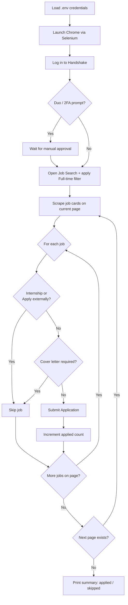

<p align="center">
  
</p>

<h1 align="center">Handshake QuickApply Bot</h1>

<p align="center">
  Automate quick-applying to jobs on <a href="https://joinhandshake.com/">Handshake</a> (built and tested against the ASU instance) using Selenium and the Chrome WebDriver.
</p>

<p align="center">
  
  
  
  
</p>

---

## Why this exists

Job hunting on Handshake means scrolling through hundreds of postings and clicking "Apply" over and over. This bot automates that grind — logging in, filtering to full-time roles, walking every page of results, and submitting quick applications wherever no extra input (like a cover letter) is required. It's especially useful for Juniors and Seniors doing high-volume applications in their field.

## Proof it works

<p align="center">
  
</p>

<p align="center"><em>Several hundred applications submitted on August 25th — with real responses coming back.</em></p>

## How it works



## Features

- **Login automation** — signs in using credentials stored in environment variables, and pauses for manual Duo/2FA approval when required.
- **Full-time filtering** — automatically applies the "Full-time" job filter before scanning listings.
- **Job posting scraper** — walks every job card on a page and pulls out job IDs/details.
- **Smart skip logic** — skips internships, "Apply externally" listings, and applications that require a cover letter.
- **Automated quick-apply** — submits applications where no extra input is needed.
- **Pagination handling** — clicks through every page of results (preserving filters) until none remain.
- **Run summary** — reports total jobs applied to vs. skipped at the end of the run.

## Requirements

Before running the script, make sure you have:

- **Python 3.x** — [download here](https://www.python.org/downloads/)
- **Google Chrome**, kept up to date
- The following Python packages:

```bash
pip install selenium webdriver-manager python-dotenv
```

## Setup

1. Clone the repo:

   ```bash
   git clone https://github.com/imjbassi/handshake-apply.git
   cd handshake-apply
   ```

2. Copy `.env.example` to `.env` and fill in your details:

   ```bash
   cp .env.example .env
   ```

   ```env
   HANDSHAKE_EMAIL=your_handshake_email
   HANDSHAKE_PASSWORD=your_handshake_password
   NAME=your_name
   LINKEDIN_EMAIL=your_linkedin_email
   Phone_Number=your_phone_number
   Residency=your_location
   Employed_Currently=employed_status (yes/no)
   Need_Visa=visa_status (yes/no)
   YearsOfCoding=number_of_years_of_experience
   EXPERIENCE=description_of_experience
   LanguagesKnown=languages_you_speak
   CodingLanguagesKnown=coding_languages_you_know
   ```

   > These fields exist for potential future AI-assisted form/cover-letter generation — see [Roadmap](#roadmap).

3. Run the script:

   ```bash
   python AutomatedHandshake.py
   ```

   Tip: running it from an integrated terminal (e.g. VS Code) makes it much easier to start/stop mid-run.

## Handling Duo / 2FA

If your institution requires Duo authentication for Handshake, the script will pause and wait — approve the push notification on your device, and it will pick back up automatically.

## Roadmap

- [ ] AI-generated cover letters using the `context` dictionary already collected in `.env`
- [ ] More granular error handling with specific exception types
- [ ] Configurable filters beyond "Full-time" (location, role type, keywords)
- [ ] Headless mode with a summary report file

## Disclaimer

This script is for **educational and personal use only**. Automating job applications may be subject to the terms of service of the platforms you use, including Handshake — use at your own discretion and risk.
